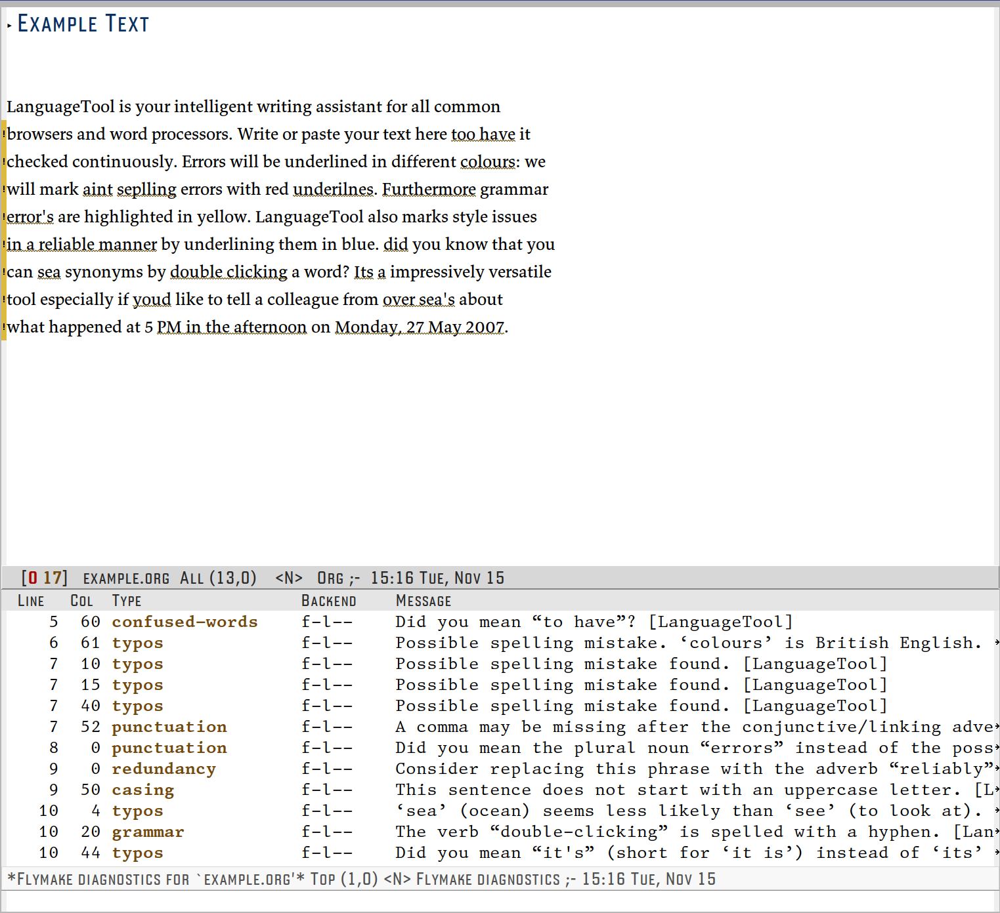

<div align="center">
  
</div>

<div align="center">

[](https://www.gnu.org/licenses/gpl-3.0)
[](https://melpa.org/#/flymake-languagetool)
[](https://stable.melpa.org/#/flymake-languagetool)
[](https://github.com/jcubic/alt/actions/workflows/test.yml)
[](https://docs.github.com/en/pull-requests/collaborating-with-pull-requests/proposing-changes-to-your-work-with-pull-requests/creating-a-pull-request)
[](https://github.com/bbatsov/emacs-lisp-style-guide)

# ALT's Language Tool

ALT is a maintained fork of [flymake-langaugetool](https://github.com/emacs-languagetool/flymake-languagetool).

</div>

## 🖥️ Screenshot


## 💾 Installation

The instruction to use this plugin.

1. **For a Local Server:** Download LanguageTool from https://languagetool.org/download/ and
   extract on to your local machine.
   **For a Remote Server:** If you are using LanguageTool's API and have a premium
   account you will need your username and an api key you can generate
   here https://languagetool.org/editor/settings/access-tokens
2. Consider adding one of the following snippets to your configuration.

#### Local LanguageTool Server

```el
(use-package alt
  :ensure t
  :hook ((text-mode       . alt-mode)
         (latex-mode      . alt-mode)
         (org-mode        . alt-mode)
         (markdown-mode   . alt-mode))
  :init
  ;; Local Server Configuration
  (setq alt-languagetool-server-jar
    "path/to/LanguageTool-X.X/languagetool-server.jar"))
```

#### Free LanguageTool Account
```el
(use-package alt
  :ensure t
  :hook ((text-mode       . alt-mode)
         (latex-mode      . alt-mode)
         (org-mode        . alt-mode)
         (markdown-mode   . alt-mode))
  :init
  ;; LanguageTools API Remote Server Configuration
  (setq alt-languagetool-server-jar nil)
  (setq alt-languagetool-url "https://api.languagetool.org"))
```

#### Premium LanguageTool Account
```el
(use-package alt
  :ensure t
  :hook ((text-mode       . alt-mode)
         (latex-mode      . alt-mode)
         (org-mode        . alt-mode)
         (markdown-mode   . alt-mode))
  :init
  ;; If using Premium Version provide the following information
  (setq alt-languagetool-server-jar nil)
  (setq alt-languagetool-url "https://api.languagetoolplus.com")
  (setq alt-languagetool-api-username "myusername")
  (setq alt-languagetool-api-key "APIKEY"))
```

3. :tada: Done! `alt-mode` turns on Flymake automatically, so just open a
   text file. You can also toggle it manually with `M-x alt-mode`.

### Enabling with other Flymake checkers

`alt-mode` is a convenience minor mode: it registers the LanguageTool
checker and turns on `flymake-mode` for you. When you disable it, it turns
`flymake-mode` back off again — but only if `alt-mode` was what enabled it
and no other Flymake backend is still using it. A `flymake-mode` you turned
on yourself, or one shared with other Flymake backends, is left alone.

(Note: [Flycheck](https://www.flycheck.org/) is a separate system from
Flymake, so `alt-mode` never affects your Flycheck checkers either way.)

If you manage `flymake-mode` yourself, or want to combine ALT with other
Flymake backends in the same buffer, use `alt-load` instead — it only
registers the checker and leaves `flymake-mode` to you:

```el
(add-hook 'text-mode-hook #'alt-load)
(add-hook 'text-mode-hook #'flymake-mode)
```

Another option is to add `alt-maybe-load` to
`find-file-hook`, this way `alt` will be enabled
whenever `flymake-mode` is active and the current major-mode is
included in `alt-active-modes`.

```el
(add-hook 'find-file-hook 'alt-maybe-load)
```

## 🧪 Configuration

### Language
The language used for flymake can be customized by using
`alt-language` (Default `"en-US"`)

### Active Modes

If you are using `alt-maybe-load` you can customize
which modes `alt` will be enabled for by adding a
major-mode to `alt-active-modes`. The default value
is `'(text-mode latex-mode org-mode markdown-mode message-mode)`

### Spellchecking

LanguageTool’s spellchecking is disabled by default. If
`alt-check-spelling` is non-nil LanguageTool will check
for spelling mistakes.

### Disabling Rules & Categories

Specific rules can be disabled using
`alt-disabled-rules`. For example, LanguageTool's
whitespace rule can be a bit verbose in `org-mode` and it can be
disabled by adding its ID to this variable.

```el
(push "WHITESPACE_RULE" alt-disabled-rules)
```

The full list of rules and their IDs can be found [here](https://community.languagetool.org/rule/list?lang=en).

Similarly, you can disable categories using the
`alt-disabled-categories` variable. The full list of
categories can be found in `alt-category-map`

You can also disable rules and categories interactively with the `Ignore`
option. These rules will be ignored temporarily, for the current buffer
only.

### Corrections

Suggestions from LanguageTool can be applied with:

`alt-correct`: select error in current buffer with
    completing read

`alt-correct-at-point`: correct error at point

`alt-correct-dwim`: if point is on a
    `alt` error then correct; otherwise, select one
    from the current buffer.

`alt-correct-auto`: replace the error at point with
    LanguageTool's first suggestion, without any prompt or popup.
    Handy together with `alt-next` for quick passes — but it applies
    the top suggestion blindly, so review the result (a single `undo`
    reverts it).

#### Correction style

`alt-correct-style` controls how corrections are presented (default
`minibuffer`):

- `minibuffer` — pick a correction with `completing-read`.
- `company` — show an in-buffer [company](https://company-mode.github.io/)
  popup at the error. Each row is the correction word, followed by the
  `Ignore Rule` / `Ignore Category` actions. With this style the echo-area
  diagnostic drops the inline `(try: …)` hint, since corrections come from
  the popup instead.

```el
(setq alt-correct-style 'company)
```

`company` is an **optional dependency**: `alt` never loads it for you.
Install it (`M-x package-install RET company`) and enable `company-mode`
in the buffer (`alt` will enable it locally if needed). If the package is
not available, `alt` warns once and falls back to the `minibuffer` style.

### Key Bindings

`Alt` doesn't have its own keybindings, but you can add them yourself.

Here are example keybindings.

```el
(defun setup-alt ()
  (interactive)
  (local-set-key (kbd "C-S-SPC") 'alt-correct-at-point)
  (local-set-key (kbd "C-:") 'alt-correct-auto)
  (local-set-key (kbd "C-S-p") 'flymake-goto-prev-error)
  (local-set-key (kbd "C-S-n") 'flymake-goto-next-error)
  (company-mode +1)
  (alt-mode))
```

### Categories

By default, `alt` will now provide LanguageTool
category information for each identified error. If you wish to disable
this behavior, you can set `alt-use-categories = nil`.



## ⚜️ License

This program is free software; you can redistribute it and/or modify
it under the terms of the GNU General Public License as published by
the Free Software Foundation, either version 3 of the License, or
(at your option) any later version.

This program is distributed in the hope that it will be useful,
but WITHOUT ANY WARRANTY; without even the implied warranty of
MERCHANTABILITY or FITNESS FOR A PARTICULAR PURPOSE.  See the
GNU General Public License for more details.

You should have received a copy of the GNU General Public License
along with this program.  If not, see <https://www.gnu.org/licenses/>.

See [`LICENSE`](./LICENSE.txt) for details.
